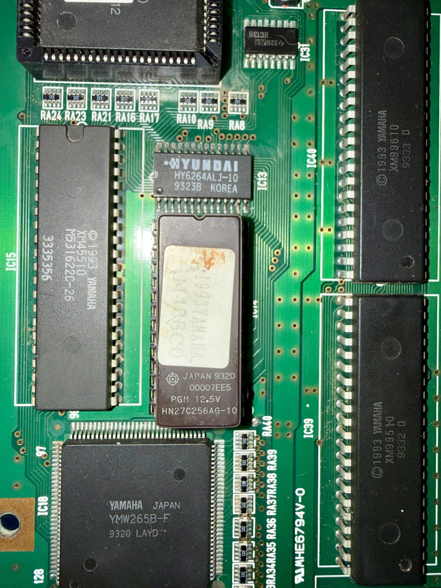
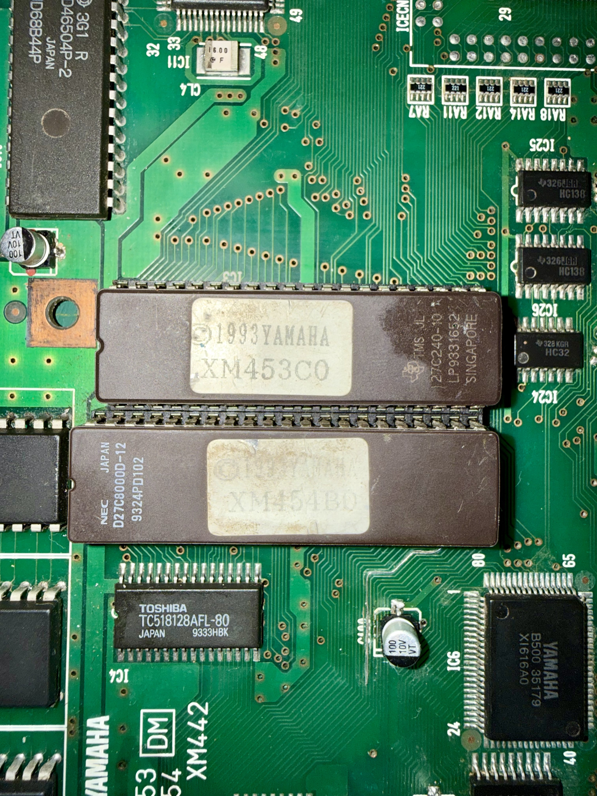
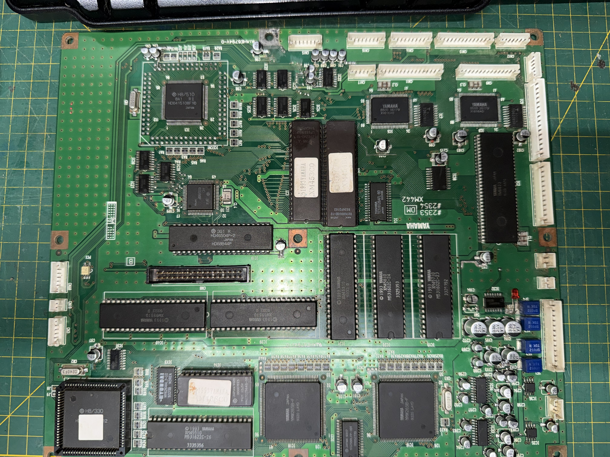

# Yamaha Clavinova CVP-87A — ROM Dumps

This repository contains ROM dumps extracted from the main board of a **Yamaha Clavinova CVP-87A** digital piano.

---

## 📷 Board Photos

<!-- Add your photos here -->
<!-- Example:

-->

---

## 🗂️ ROM Files

### XM453C0 — H8/510 Boot & Main Code
| Property | Value |
|----------|-------|
| **Filename** | `27C240-10 - XM453C0.bin` |
| **Size** | 4 Mbit (512 KB) |
| **CPU** | Hitachi H8/510 |
| **Contents** | Boot code and main firmware for the primary H8/510 processor. This ROM contains the core operating logic of the instrument, responsible for initialization, system control, and the main execution loop. |

---

### XM454B0 — Data & Functionality
| Property | Value |
|----------|-------|
| **Filename** | `D27C8000D - XM454B0.bin` |
| **Size** | 8 Mbit (1 MB) |
| **CPU** | — |
| **Contents** | General data and extended functionality ROM. This is the largest EPROM on the board and likely stores voice data, preset parameters, panel function tables, and other static data referenced at runtime by the main processor. |

---

### XM456C0 — H8/330 Boot & Main Code
| Property | Value |
|----------|-------|
| **Filename** | `HN27C256AG - XM456C0.bin` |
| **Size** | 2 Mbit (256 KB) |
| **CPU** | Hitachi H8/330 |
| **Contents** | Boot code and main firmware for the secondary H8/330 processor. This smaller CPU typically handles dedicated sub-tasks such as panel/keyboard scanning, MIDI I/O, or other peripheral management. |

---

## 🎹 About the CVP-87A

The **Yamaha Clavinova CVP-87A** is a consumer-grade digital piano from Yamaha's CVP (ClavinovaVA) series. It features built-in accompaniment styles, multiple voices, and a full-weighted keyboard, representing the technology of its era.

---

## ⚠️ Disclaimer

These dumps were extracted for **preservation and educational purposes only**. All firmware and data contained in these ROMs are the intellectual property of Yamaha Corporation. Use them responsibly and in accordance with applicable laws.

---

## 📝 Notes

- Dumped with: Elnec BeeProg
- Dump date: 2021-10-08
- Verified: Not verified yet. No any other source available.
